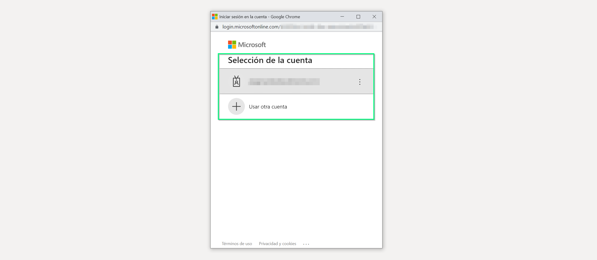

# How to use the Web UI solution

## Introduction

## Getting Started
This document is intended to provide the guidance needed by the user to operate the Broadcast Development Kit (BDK) through the Web UI sample. This includes:

- [Authentication](#authentication).
- [Check Bot Service Status](#check-bot-service-status).
- [Join the Bot into a meeting](#join-the-bot-into-a-meeting).
- [Call info status and streaming protocol configuration](#call-info-status-and-streaming-protocol-configuration).
- [How to inject a stream into the meeting](#how-to-inject-a-stream-into-the-meeting).
- [How to extract a stream from the meeting](#how-to-extract-a-stream-from-the-meeting).

### Authentication
Once you entered the URL in the Browser at first time, the Web UI renders the `Login` view. Please, click on the `Login with your account` to enter your Azure AD credentials. 

Ad or select the account you want to log in with.

### Check Bot Service Status
After authenticating, the first thing you need to check is the Bot Service status. You can verify it by entering in the `Bot Service Status` tab located in the header of the Web UI.

If the Bot Service Status is `Deprovisioned` like the picture above shows, you will need to provision the service by clicking on the `Start` button on the Bot Service Card. After a few seconds, the Bot Service will be provisioned.

### Join the Bot into a meeting
Once the Bot service is provisioned, you can invite the bot into a Microsoft Teams meeting. You need to go to the `Join a Call` tab located in the header of the Web UI.

Please enter the meeting URL in the `Invite URL` text field and click on the `Join Call` button below. After few seconds, the Bot will be joined into the meeting associated with the URL you provided.

> **NOTE:** To be able to invite the Bot into a meeting, a Microsoft Teams meeting needs to be scheduled.

### Call info status and streaming protocol configuration
During the call establishment, a Call details view will be rendered. In this view you will see the following sections:

- [Call Information View](#call-Information-view).
- [Injection Stream](#injection-stream).
- [Active Streams](#active-streams).
- [Main Streams](#main-streams).
- [Participants](#participants).

#### Call Information View
In this section is rendered the information related to the call and the streaming protocol configured.

For the call you can see the following information:

- ***Status***: Display the current call status (Establishing, Established, Terminated).
- ***Active Streams***: Display the number of...
- ***Invite Link***: Display a button to copy the Microsoft Teams meeting URL.
- ***Call type***: Display type of call (Default, Live event) and the number of participants in the meeting.
- ***Created***: Display the time when the Bot was joined into the meeting.

For the streaming protocol selected, you can see the following information.

- ***Default Protocol***: The streaming protocol selected for the call (SRT or RTMP).
- ***Bot FQDN***: The domain where the Bot Service is hosted.

>**NOTE**: If the selected protocol is SRT, you can also see other information related to that protocol, such as, `Latency`, `Passphrase`, among others. 

#### Injection Stream
This section renders a `Card` that allows you to configure and start the stream injection into the current meeting. To start an injection please refer to the section [How to inject a stream into the meeting](#how-to-inject-a-stream-into-the-meeting)

#### Active Streams
This section renders a `Card` for each [Main](#main-streams) and [Participant](#participants) stream/s being extracted. In those `Card` you can find the information related to the extracted stream itself, also you can stop the extraction.

#### Main Streams
This section renders a `Card` for each `Main Stream` available for the current call from where you can start the stream extraction. The `Main Stream` are:

- Primary Speaker.
- Screen Share.
- Together Mode.
- Large Gallery. 

>**NOTE**: The `Together Mode` and the `Large Gallery` are only visible in this section if they are activated in the Microsoft Teams client.

#### Participants
This section renders a `Card` for each participant present in the meeting from where you can start the stream extraction.

### How to inject a stream into the meeting
To start an extraction, 

### How to extract a stream from the meeting

